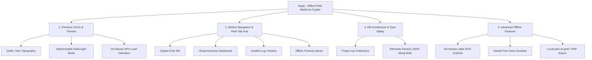

# g4_ex

A new Flutter project.

```mermaid
graph TD
    A[Aegis - Offline Field Medicine Copilot] --> B[1. Premium UI/UX & Themes]
    A --> C[2. Bottom Navigation & Multi-Tab Hub]
    A --> D[3. DB Architecture & Type-Safety]
    A --> E[4. Advanced Offline Features]

    B --> B1[Outfit / Inter Typography]
    B --> B2[Glassmorphic Dark/Light Mode]
    B --> B3[On-Device GPU Load Indicators]

    C --> C1[Copilot Chat Tab]
    C --> C2[Visual Inventory Dashboard]
    C --> C3[Incident Log Timeline]
    C --> C4[Offline Protocol Library]

    D --> D1[Proper Isar Collections]
    D --> D2[Eliminate Generic JSON String Note]

    E --> E1[On-Device Label OCR Scanner]
    E --> E2[Hands-Free Voice Dictation]
    E --> E3[Local peer-to-peer / PDF Export]
```