# 🛡️ Aegis - Offline Field Medicine Copilot

Aegis is a premium, state-of-the-art **Offline Field Medicine Copilot** built using Flutter, running a local instance of Google's **Gemma 4 E2B** model via LiteRT, and utilizing **Isar** as a high-performance local NoSQL database. It is designed specifically for off-grid, disaster recovery, and tactical emergency scenarios where cloud connectivity is compromised or entirely unavailable.

---

## 📐 System Architecture

Aegis operates on a strictly **local-first, zero-network architecture**. The diagram below illustrates how user prompts and visual inputs flow through the on-device model, map to registered tools, update the reactive local database, and render rich responses back to the user.

```mermaid
graph TD
    %% Core Styling
    classDef ui fill:#0F172A,stroke:#00E5FF,stroke-width:2px,color:#FFFFFF
    classDef agent fill:#0F172A,stroke:#A855F7,stroke-width:2px,color:#FFFFFF
    classDef model fill:#0F172A,stroke:#E2E8F0,stroke-width:2px,color:#FFFFFF
    classDef db fill:#0F172A,stroke:#10B981,stroke-width:2px,color:#FFFFFF
    classDef tools fill:#0F172A,stroke:#F59E0B,stroke-width:2px,color:#FFFFFF

    subgraph UI_Layer ["Flutter Responsive UI Layer"]
        A["Welcome / Bottom Nav Hub"]:::ui
        Tab1["Copilot Chat Tab"]:::ui
        Tab2["Inventory Dashboard"]:::ui
        Tab3["Incidents Timeline"]:::ui
        Tab4["Offline Handbook"]:::ui
    end

    subgraph Agent_Orchestrator ["Agent & Tool Orchestration Layer"]
        AC["Agent Coordinator"]:::agent
        TR["Tool Registry"]:::agent
    end

    subgraph local_llm ["On-Device AI Engine"]
        GM["Gemma 4 E2B (LiteRT)"]:::model
    end

    subgraph Tool_System ["Dynamic Tool Registry"]
        BT["BaseTool Abstract Interface"]:::tools
        T1["inventory_add_item"]:::tools
        T2["inventory_update_item"]:::tools
        T3["inventory_search"]:::tools
        T4["inventory_low_stock"]:::tools
        T5["incident_log"]:::tools
        T6["incident_search"]:::tools
        T7["protocol_lookup"]:::tools
        T8["html_render_tool"]:::tools
    end

    subgraph Data_Storage ["Offline NoSQL Data Layer"]
        DB["Isar Database Instance"]:::db
        S1["InventoryItem Collection"]:::db
        S2["IncidentLog Collection"]:::db
    end

    %% Workflow Connections
    Tab1 -->|"1. User Query + Photo (Bytes)"| AC
    AC -->|"2. Assemble System Prompt & Tools JSON"| TR
    TR -->|"3. System Prompt + User Query"| GM
    GM -->|"4. JSON Tool Selection"| AC
    AC -->|"5. Route & Execute with Args"| BT
    BT -->|"6. Read/Write Data"| DB
    DB -.->|"Reactive Streams"| Tab2
    DB -.->|"Reactive Streams"| Tab3
    BT -->|"7. Return ToolResult (Output / UI Data)"| AC
    AC -->|"8a. If UI Component exists"| Tab1
    AC -->|"8b. Conversational Synthesis Prompt"| GM
    GM -->|"9. Streaming Calm Medical Guidance"| Tab1

    %% Database Relationships
    DB --- S1
    DB --- S2
```



---

## 🤖 The Implemented Agent System

The core of Aegis is its elegant, **multi-stage on-device agentic cycle**. Unlike traditional chatbot applications, the agent acts as an autonomous router and structured program executor, ensuring high precision even when running a lightweight LLM on limited mobile hardware.

### 1. Two-Stage Execution Loop
To maximize accuracy and bypass the reasoning constraints of an on-device **Gemma 4 E2B** model, the `AgentCoordinator` splits model communication into two specialized steps:

```
[ User Prompt + Image ]
          │
          ▼
┌──────────────────────────────────────────────┐
│  Stage 1: Intent Routing & Parameter Parsing │  <-- Temp: 0.0 (Deterministic)
│  - Evaluates registered JSON-Schema tools    │
│  - Performs OCR/multimodal extraction        │
│  - Outputs Structured JSON decision          │
└──────────────────────────────────────────────┘
          │
          ▼
┌──────────────────────────────────────────────┐
│  Stage 2: Execution & Local Database Sync    │  
│  - Locates and executes mapped tool class    │
│  - Completes type-safe Isar query or write   │
│  - Captures returned ToolResult output       │
└──────────────────────────────────────────────┘
          │
          ▼
┌──────────────────────────────────────────────┐
│  Stage 3: Conversational Synthesis           │  <-- Temp: 0.2 (Fluent & Safe)
│  - Combines user context & tool outcome      │
│  - Applies final clinical voice directives   │
│  - Streams natural safety-focused text back  │
└──────────────────────────────────────────────┘
```

* **Stage 1 (Intent & Parameter Routing):** The coordinator spins up a local inference session using a deterministic temperature of `0.0`. It presents Gemma with a compiled list of tool definitions derived directly from `BaseTool` JSON schemas. Gemma evaluates the user's intent and outputs a strictly formatted JSON object designating the chosen tool and parsing all required parameters (e.g. quantities, units, symptom severity).
* **Stage 2 (Programmatic Execution):** The coordinator intercepts the JSON, resolves the tool from `ToolRegistry`, and triggers `execute()`. This handles database writes/searches or static handbook lookups completely in native Dart. Handled errors return a diagnostic alert rather than crashing the interface.
* **Stage 3 (Conversational Synthesis):** The coordinator initiates a second conversational session at a temperature of `0.2`. It inputs the original prompt, the raw tool execution result, and a set of **clinical-voice guidelines** (instructing the agent to remain calm, avoid returning technical JSON formatting, and always include a safety disclaimer).

### 2. Multimodal Visual Intelligence
Aegis fully exploits on-device vision capabilities:
* **Automated Supply Logging:** Responders can take a picture of a medical supply box or medication bottle. Guided by visual system prompts, Gemma analyzes the image text (OCR), extracts the product name, unit format, and quantity, and translates this directly into a structured call to `inventory_add_item` without manual typing.
* **Visual Incident Triage:** Attaching a photo of an injury or wound allows the agent to evaluate the visual symptoms, catalog the injury details, assign a proper severity rating (low, medium, high), and pre-populate an `IncidentLog` entry.

### 3. Comprehensive Tool Suite
Aegis comes equipped with eight custom-built tools:
| Tool Name | Class | Functionality |
| :--- | :--- | :--- |
| `inventory_add_item` | `InventoryAddTool` | Inserts a new medical supply record into the local database. |
| `inventory_update_item` | `InventoryUpdateTool` | Increments, decrements, or replaces stock counts in real time. |
| `inventory_search` | `InventorySearchTool` | Locates specific medical goods across storage locations. |
| `inventory_low_stock` | `InventoryLowStockTool` | Quickly generates lists of exhausted or critically low supplies. |
| `incident_log` | `IncidentLogTool` | Commits clinical emergency logs (descriptions, symptoms, severity, and photo assets) to database. |
| `incident_search` | `IncidentSearchTool` | Queries past incident records by patient keywords or symptoms. |
| `protocol_lookup` | `ProtocolLookupTool` | Fetches step-by-step offline medical guides for acute trauma from internal assets. |
| `html_render` | `HtmlRenderTool` | Builds structured, responsive cards and reports directly inside the chat interface. |

---

## 🛠️ Offline Technology Stack

Aegis's robustness is powered by a high-performance, open-source stack that prioritizes on-device speed, safety, and visual appeal:

* **Frontend Framework:** [Flutter](https://flutter.dev) & Dart – provides cross-platform compilation (iOS, Android, Windows) with native-speed UI rendering.
* **On-Device LLM Integration:** `flutter_gemma` – wraps LiteRT (formerly TensorFlow Lite) to run quantized Google Gemma weights directly on mobile GPUs/CPUs.
* **High-Performance NoSQL Database:** `isar_community` – a lightweight, ultra-fast database that generates type-safe schemas, handles binary blobs (Uint8List photo bytes), and supports reactive streams to keep visual dashboards instantly synchronized.
* **Typography System:** **`Outfit`** for primary UI elements and dashboards (providing a modern, clean sans-serif look) and **`Lora`** for handbook protocols and checklists (providing a readable, authoritative, serif "clinical manual" texture).

---

## 🔮 Blueprint & Future Adaptation Opportunities

Aegis is not just a field medicine app; it is a **highly reusable architecture blueprint** for any domain requiring **intelligent, offline, on-device decision-making and record keeping**. 

Developers can adapt this repository to create tailored offline copilots for a wide variety of sectors:

### 1. Off-Grid Wilderness Exploration Companion
* **Target Users:** Hikers, mountaineers, park rangers, and geological survey teams.
* **Purpose:** Serves as a disconnected survival assistant for navigation, flora/fauna identification, and equipment inventory.
* **How to Adapt:**
  * **Schemas:** Keep `InventoryItem` (for camping/survival gear) and replace `IncidentLog` with a `SightingLog` or `HazardMap` (tracking coordinates, wildlife warnings, and terrain photos).
  * **Tools:** Swap medical tools for `map_waypoint_add`, `wildlife_identify_vision`, and `survival_protocol_lookup` (e.g. fire making, shelter building, clean water sourcing).

### 2. Precision Agriculture & Smart Farming Copilot
* **Target Users:** Farmers, agronomists, and crop inspectors working in vast rural fields with no cellular service.
* **Purpose:** Offline diagnostic advisor for crop diseases, pest tracking, and pesticide/fertilizer inventory management.
* **How to Adapt:**
  * **Schemas:** Keep `InventoryItem` (fertilizers, seeds, tools) and swap `IncidentLog` for a `CropIncident` collection (storing field quadrant, pest/disease symptoms, crop type, and photo of affected leaves).
  * **Tools:** Implement `pest_diagnostic_vision` (uses on-device vision to identify crop blight/insects from a leaf photo), `fertilizer_calculator`, and `pest_protocol_lookup` (fetching organic treatment procedures).

### 3. Industrial Field Maintenance & Avionics Checklists
* **Target Users:** Factory technicians, oil rig engineers, aviation mechanics, and wind turbine service crews.
* **Purpose:** On-site assistant to look up complex equipment manuals, scan barcodes/serial numbers, log maintenance activities, and manage spare parts.
* **How to Adapt:**
  * **Schemas:** Replace inventory with a `SpareParts` schema indexed by mechanical parts number. Replace incidents with `MaintenanceTicket` (storing equipment ID, diagnostic readings, parts replaced, and photos of wear/damage).
  * **Tools:** Create `serial_scan_vision` (extracting serial codes from mechanical plates), `maintenance_step_lookup` (indexing heavy equipment schemas), and `ticket_close_tool`.

### 4. Smart Home & Off-Grid Homesteading Hub
* **Target Users:** Homesteaders, off-grid cabins, and rural survivalist retreats.
* **Purpose:** Tracking water tank levels, solar battery health, canned food stores, and looking up generator/appliance repair steps offline.
* **How to Adapt:**
  * **Schemas:** Update schemas to track `PantrySupply` (expiry dates, calorie count, shelf location) and `homestead_incident` (generator failure, water line leak, structure damage).
  * **Tools:** Implement `generator_troubleshooting_protocol`, `ration_calculator`, and `consumption_log`.

### 5. Rural & Off-Grid Educational Assistant
* **Target Users:** Teachers and students in remote villages, island schools, or regions with high internet costs.
* **Purpose:** A local conversational teacher's aide that hosts textbook handbooks, helps solve equations photographed on paper, and tracks school supplies.
* **How to Adapt:**
  * **Schemas:** Use `SuppliesItem` (textbooks, tablets, science kits) and `StudentReportCard` or `LessonPlan`.
  * **Tools:** Implement `math_solver_vision` (reads formulas from paper photos and explains step-by-step solutions offline), `lesson_lookup`, and `quiz_generator_tool`.

---

## 🚀 How to Port This Blueprint: A 3-Step Guide

Swapping domains can be completed rapidly by adapting the modular architectural layers:

1. **Step 1: Redefine the Data Models (`lib/data/`)**
   Create new Dart classes decorated with `@collection` for Isar. Define your attributes (e.g. strings, integers, dates, `Uint8List` image assets). Run code generation using the build runner to compile the new collections:
   ```bash
   flutter pub run build_runner build --delete-conflicting-outputs
   ```
2. **Step 2: Swap the Agent Tools (`lib/agent/tools/`)**
   Create classes inheriting from `BaseTool`. Override `name`, `description`, and the `argumentsSchema` (which tells Gemma what arguments to extract). Implement `execute()` to query or write your new Isar collections.
3. **Step 3: Update prompts and registers (`lib/agent/`)**
   Instantiate your new tools in `AgentCoordinator`'s constructor and register them. Update `ToolRegistry.buildSystemPrompt()` with your new domain persona guidelines and instructions on how to handle attached image payloads (e.g. scanning a leaf vs. scanning a medical label).
