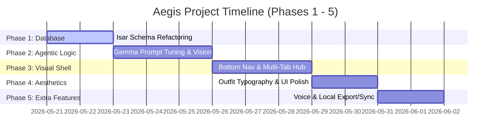

# Aegis - Offline Field Medicine Copilot
## Project Phases & Implementation Schedule

This document outlines the phased schedule for upgrading **g4_ex** into **Aegis**, a premium, state-of-the-art Offline Field Medicine Copilot. 

Our main focus is on **core functionality, robust agentic logic, and leveraging Gemma's multimodal capabilities** before adding advanced secondary features.

---

---

## Phase 1: Database Refactoring & Schema Upgrades (Core DB Safety)
*Goal: Move away from the generic, error-prone JSON-encoded `Note` table. Establish highly structured, type-safe local database tables.*

- [x] **Create Structured Isar Models**:
  - `InventoryItem` (`id`, `name`, `quantity`, `unit`, `location`, `expiryDate`, `notes`, `updatedAt`)
  - `IncidentLog` (`id`, `title`, `description`, `severity`, `symptoms`, `actionTaken`, `imageBytes`, `createdAt`)
- [x] **Generate Database Schemas**:
  - Run the `build_runner` builder tool (`flutter pub run build_runner build --delete-conflicting-outputs`) to compile `inventory_item.g.dart` and `incident_log.g.dart`.
- [x] **Update Database Layer**:
  - Update `lib/data/isar_database.dart` to open Isar with the new collections instead of `NoteSchema`.
  - Update seed data logic in `AgentCoordinator` to pre-populate these exact tables.
- [x] **Refactor Existing Tools**:
  - Update the inventory tools (`add`, `update`, `search`, `low_stock`) and incident tools (`log`, `search`) in `lib/agent/tools/` to interact with the new structured collections instead of reading/writing JSON strings in a `Note` object.

---

## Phase 2: Prompt Engineering & Multimodal Agentic Logic
*Goal: Optimize the on-device agentic cycle. Ensure that Gemma carefully parses intent, makes extremely robust tool-calling decisions, and handles image inputs natively.*

- [x] **Multimodal Gemma Prompting (No External OCR)**:
  - Refine the core agent instructions in `ToolRegistry` to instruct Gemma on how to handle image payloads.
  - For example, if the user snaps a picture of an inventory item box, Gemma will process the image, extract the label details (name, count, unit) natively through its visual capabilities, and call `inventory_add_item` with the extracted details.
  - If a user sends a photo of an injury, Gemma should call `incident_log` with the visual symptoms pre-filled.
- [x] **Structured JSON Decision Validation**:
  - Implement a stricter parser and fallback recovery in `AgentCoordinator` to handle edge-case JSON outputs from Gemma 2B. 
  - Ensure temperature is set to `0.0` for tool decisions to ensure deterministic results.
- [x] **Integrate Image Storage**:
  - Update the tool runner so that when an image is processed during a tool call, the raw `Uint8List` image bytes are stored directly inside the `IncidentLog` collection in Isar.

---

## Phase 3: Bottom Navigation & Multi-Tab Shell
*Goal: Create a complete, functional app layout so responders can directly view and edit data without always going through the chat agent.*

- [x] **Bottom Navigation Bar**:
  - Refactor `lib/main.dart` to introduce a modern, clean bottom navigation layout.
- [x] **Four Dedicated Tabs**:
  1. **Copilot (Chat)**: Upgrade the chat console, rendering structured tool results in HTML cards.
  2. **Inventory Dashboard**: A visual dashboard listing supplies, categorizing them, and displaying glowing stock-level badges (Green = Good, Yellow = Low, Red = Out). Includes a quick text search and location filtering.
  3. **Incidents Timeline**: A clean vertical feed displaying logged incidents with severity level badges (Low, Medium, High), actions taken, and quick visual thumbnails.
  4. **Handbook**: Direct scrollable list of offline first-aid protocols from `protocols.json` (such as bleeding control, burns, sprains) for instant clinical reference in high-stress situations.

---

## Phase 4: Aesthetic Polish & Premium Micro-Animations
*Goal: Transform the look and feel into a premium, state-of-the-art medical field tool that matches our rigorous design guidelines.*

- [x] **Typography Overhaul**:
  - Switch the primary interface font to **`Outfit`** or **`Inter`** using Google Fonts for a clean, futuristic, readable sans-serif look.
  - Retain a refined serif font (**`Lora`**) specifically for reading protocols and checklists to keep the professional "clinical manual" texture.
- [x] **Advanced Dark Mode / Light Mode**:
  - Add a theme toggle. Emphasize a deep, soothing **Tactical Dark Mode** (colors like deep slate blue, clinical teal accents, and soft alerts) which is ideal for power-outages and night work.
- [x] **Gemma Status Bar**:
  - Design a beautiful glowing status indicator in the app bar that tracks:
    - AI Engine initializing (with progress indicator)
    - Ready / GPU-accelerated active status
    - Active model specs

---

## Phase 5: Additional Offline Features (Post-Core)
*Goal: Build value-adds after the core database, agent, and visual dashboards are fully operational.*

- [ ] **Hands-Free Speech-to-Text**:
  - Integrate a microphone option next to the chat bar allowing responders to dictate incidents or inventory counts while their hands are busy.
- [ ] **PDF/CSV Report Exports**:
  - Allow users to export the active incident logs or inventory state into professionally styled PDF sheets, saved locally.
- [ ] **Local Peer-to-Peer Sync**:
  - Introduce a system to share database logs between nearby devices via localized offline Wi-Fi or Bluetooth hotspots, enabling field sync in disaster areas.
